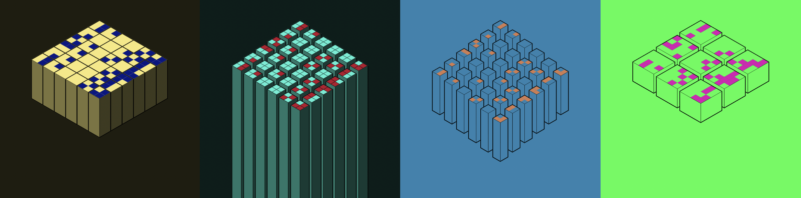

# fiveoutofnine
**fiveoutofnine** is the first **100% on-chain** chess engine, where minters **play against the smart
contract**. Each move is minted as an NFT, and accompanied by a generative art piece. The majority of
the project's development and beauty is in its algorithms and code that enable such complex
computing, so the art highlights its design and implementation. All metadata and art is generated
and stored 100% on-chain as well (see [`fiveoutofnineART.sol`](https://github.com/fiveoutofnine/fiveoutofnine-chess/tree/main/src/fiveoutofnineART.sol)).



fiveoutofnine at commit [`d89e62c`](https://github.com/fiveoutofnine/fiveoutofnine-chess/commit/d89e62c1072db9d06d9579c4732d416cd9a4688b)
is live on mainnet ([`0xb543f9043b387ce5b3d1f0d916e42d8ea2eba2e0`](https://etherscan.io/address/0xb543f9043b387ce5b3d1f0d916e42d8ea2eba2e0#code))

## Installation
To install with [Foundry](https://github.com/gakonst/foundry):

```
forge install fiveoutofnine/fiveoutofnine-chess
```

## Bugs
1. The engine may make a move that leaves its king in check. Pretty minor bug because the game can
progress. Just... without black's king. The fix would be to do 1 more depth of search than the input
depth. Any illegal black moves (moves that result in black's king being checked) would be eliminated
lazily in the extra depth. [<u>Example</u>](https://etherscan.io/tx/0x057b4807662481a3244a25553b52e979c6c5bb3c177344b8585ff17a2a5e0222).

2. The engine evaluates any queen/king move crossing the board's center incorrectly. `toIndex` and
`fromIndex` must be evaluated in separate if/else blocks because they are not related. i.e.

    ```js
    if (fromIndex < 0x12) { // Piece is queen or king and in the closer half
        oldPst = (getPstTwo(pieceAtFromIndex) >> (0xC * fromIndex)) & 0xFFF;
        newPst = (getPstTwo(pieceAtFromIndex) >> (0xC * toIndex)) & 0xFFF;
    } else { // Piece is queen or king and in the further half
        oldPst = (getPst(pieceAtFromIndex) >> (0xC * (fromIndex - 0x12))) & 0xFFF;
        newPst = (getPst(pieceAtFromIndex) >> (0xC * (toIndex - 0x12))) & 0xFFF;
    }
    ```

    should be

    ```js
    if (fromIndex < 0x12) { // Piece is queen or king and moves from the closer half
        oldPst = (getPstTwo(pieceAtFromIndex) >> (0xC * fromIndex)) & 0xFFF;
    } else { // Piece is queen or king and in the further half
        oldPst = (getPst(pieceAtFromIndex) >> (0xC * (fromIndex - 0x12))) & 0xFFF;
    }
    if (toIndex < 0x12) {
        newPst = (getPstTwo(pieceAtFromIndex) >> (0xC * toIndex)) & 0xFFF;
    } else {
        newPst = (getPst(pieceAtFromIndex) >> (0xC * (toIndex - 0x12))) & 0xFFF;
    }
    ```

    There are some minor inaccuracies when the wrong PST is read from fortoIndex. A major inaccuracy
    occurs when `toIndex` is greater than `0x12`, it underflows (because it is a `uint256`) and
    bitshifts the corresponding PST to `0`. When this happens, any queen/king move is evaluated as a
    "very bad" move.